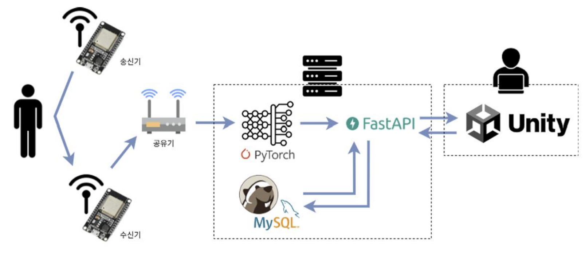
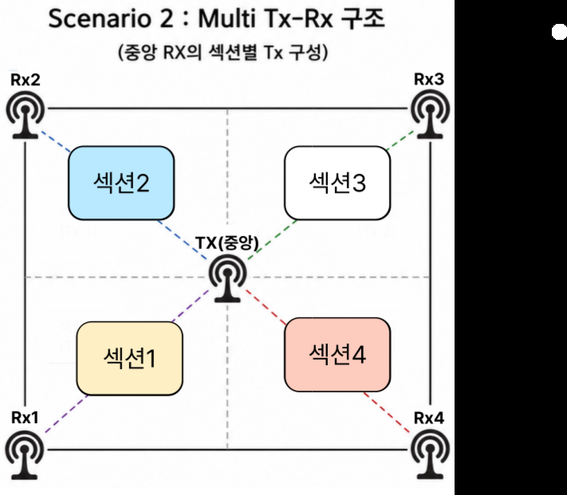

# Wi-Finder: WiFi CSI를 활용한 유니티 기반 실내 신원 식별 시스템

> **부산대학교 정보컴퓨터공학부 2026 전기 졸업과제 (TEAM-26)**  
> **과제명**: CSI 분석을 통한 유니티 기반 실내 신원 파악 시스템 구현  
> **팀명**: Wi-Finder  
> **지도교수**: 김종덕
> **팀원**: 김민현, 김민경, 박한별  

---

## 1. 프로젝트 배경

### 1.1. 국내외 시장 현황 및 문제점
- **비접촉 실내 센싱 기술의 수요 급증**:
  - 최근 스마트 홈, 스마트 헬스케어, 실내 보안 및 시니어 안심 케어 시스템 등 다양한 분야에서 실내 재실자의 위치, 상태, 신원을 비접촉 방식으로 인식하는 기술에 대한 수요가 빠르게 증가하고 있습니다.
- **기존 카메라 기반 시스템의 한계**:
  - 기존의 카메라 기반 식별 시스템은 사생활 침해 및 사각지대를 감지하지 못 한다는 단점이 존재합니다.
- **기존 Wi-Fi CSI 센싱 선행연구의 한계점**:
  - 무선 신호가 공간을 이동하며 환경적 요인과 인체에 의해 변형되는 물리 계층 특성을 담고 있는 CSI(Channel State Information, 채널 상태 정보)를 활용한 Wi-Fi 센싱 기술이 대안으로 부각되고 있습니다.
  - 그러나 기존 연구들의 대다수는 1인을 기준으로 위치를 추정하거나 제스처를 인식하는 등 단일 목적 중심의 연구에 편중되어 있었습니다.
  - 실제 실내 환경은 다수의 사용자가 동시에 출입하고 공존하는 공간이므로 기존 연구는 이를 다루지 못하는 한계가 있었습니다.

### 1.2. 필요성과 기대효과
- **프로젝트의 필요성**:
  - 기존의 단일 사용자 중심의 연구를 벗어나 다중 사용자 신원을 식별할 수 있습니다.
- **기대효과**:
  - **인프라 비용의 획기적 절감**: 널리 보급된 2.4GHz Wi-Fi 환경과 저가형 상용 ESP32-C6 보드만으로 시스템을 구축이 가능합니다.
  - **사생활 보호(Privacy-Preserving)**: 카메라와 같은 영상 센서를 일절 사용하지 않고 CSI 패턴만을 분석하므로 개인정보 유출 위험 없이 24시간 상시 관제가 가능합니다.
  - **직관적인 3D 디지털 트윈 관제**: 유니티(Unity) 엔진을 활용하여 실제 실험 공간을 1:1로 매핑한 3D 가상 공간에 인물별 3D 캐릭터 모델과 애니메이션으로 위치와 신원을 실시간 트래킹하여 직관적이고 효율적인 모니터링 환경을 제공합니다.

---

## 2. 개발 목표

### 2.1. 목표 및 세부 내용
- **최종 개발 목표**: 저비용 ESP32-C6 보드를 활용하여 다중 사용자 환경의 Wi-Fi CSI 데이터를 수집 및 분석하고, 사람 수 추정, 위치 및 신원 식별을 동시에 수행하여 유니티 기반 3D 가상 공간에 실시간으로 시각화하는 실내 신원 식별 시스템 구현.
- **주요 세부 내용**:
  1. **ESP32-C6 기반 다중 송수신(1-Tx / 4-Rx) 하드웨어 환경 구축**:
     - 부산대학교 자연대연구실험동 313-1호 연구실에 송신기 1대와 4개 사분면 구역(Section 1~4)별 수신기 4대를 배치하여 2.4GHz Wi-Fi 대역의 다중경로 신호 수집.
     - 초당 10패킷(10Hz)의 주기적인 CSI 패킷 전송 및 UDP 통신 파이프라인 구성.
  2. **다중 수신기 신호 동기화 및 전처리 파이프라인 개발**:
     - 4대 수신기의 패킷 도착 시점 편차를 보정하기 위한 타임스탬프 기반 버퍼 큐 수신 동기화 모듈 개발.
     - 64개 서브캐리어 중 널/파일럿/가드밴드/DC 노이즈에 해당하는 12개를 제거하고 52개의 유효 서브캐리어 추출 및 복소수(I, Q) 기반 진폭 계산.
     - 윈도우 슬라이딩(Window Sliding)을 통한 노이즈 억제 및 시간 연속성 데이터 구성.
  3. **머신러닝/딥러닝 기반 인원·위치·신원 식별 모델 구현**:
     - KNN 분류기를 통한 단일 수신기 및 다중 수신기(4-Rx) 환경에서의 인원수, 위치, 개인 식별 모델 구현.
     - 미수집 사용자 조합 예측을 위한 CSI 합성 및 분리 알고리즘 연구.
  4. **유니티 실내 신원 식별 시스템 개발**:
     - 자연대연구실험동 313-1호를 1:1 실측 비율로 매핑한 3D 가상 환경 모델링 
     - 실험 참가자 4인(한별, 민경, 민현, 조교)의 전용 3D 캐릭터 모델 매핑 및 Mixamo 대기 애니메이션 적용.
     - FastAPI 기반 추론 서버와 유니티 간 NativeWebSocket 비동기 통신을 구축하여 JSON DTO 역직렬화 및 4개 구역 캐릭터 실시간 스폰/회수 처리.
     - CCTV 카메라 시점 전환(키보드 1~4번) 및 마우스 회전 제어 시스템 구현.

### 2.2. 기존 서비스 대비 차별성
| 비교 항목 | 카메라 기반 시스템 | 웨어러블/비콘 기반 시스템 | 기존 Wi-Fi CSI 선행연구 | 본 프로젝트 (Wi-Finder) |
| :--- | :--- | :--- | :--- | :--- |
| **감지 방식** | 광학 영상 촬영 | 센서/태그 직접 소지 및 부착 | 무선 CSI 신호 분석 | **무선 CSI 신호 + 3D 디지털 트윈** |
| **프라이버시** | 사생활 침해 위험 극히 높음 | 상시 위치 추적에 대한 거부감 | 신호 레벨 분석으로 사생활 보호 | **영상 미사용으로 100% 프라이버시 보장** |
| **환경 영향** | 조명, 어두운 환경, 장애물 차폐 취약 | 배터리 충전 및 기기 분실 위험 | 다중경로 및 환경 노이즈 영향 | **빛/차폐 무관, 무착용(Device-Free) 감지** |
| **사용자 상태** | 시야 내 이동 객체 인식 | 태그 소지자 단순 감지 | 주로 보행 등 동적 움직임에 의존 | **정적(가만히 서 있는) 상태에서도 정밀 식별** |
| **센싱 범위** | 시야각(FoV) 내 위치 추정 | 단순 출입/구역 감지 | 1인 대상 단일 기능에 편중 | **다중 사용자 인원 수 + 위치 + 개인 신원 동시 식별** |
| **관제 환경** | 2D 화면 모니터링 | 단순 리스트/로그 표출 | 수치 플롯/논문 분석 수준 | **1:1 3D 디지털 트윈 실시간 인터랙티브 관제** |

### 2.3. 사회적 가치 창출 계획
- **초고령화 사회 독거노인 안심 케어 및 스마트 헬스케어**:
  - 카메라 설치에 거부감이 큰 1인 가구, 독거노인 주거지, 요양병원 등의 침실 및 화장실에 설치하여 사생활 침해 없이 재실 여부, 이상 체류, 활동 패턴을 비접촉으로 24시간 상시 모니터링할 수 있습니다.
- **스마트 빌딩 및 친환경 에너지 세이빙**:
  - 실내 구역별 인원 수와 위치를 정확히 파악하여, 재실자가 없는 구역의 조명과 냉·난방 공조(HVAC) 시스템을 능동적으로 제어함으로써 불필요한 전력 낭비를 차단하고 탄소 배출 저감에 기여합니다.
- **산업 현장 및 위험 구역 스마트 안전/보안 관리**:
  - 연구실, 전산실, 화학 약품 보관소 등 인가된 인원만 출입해야 하는 보안 구역에 비인가자 침입 시 즉시 감지하고, 격리 구역 내 특별 관리 대상자의 무단 이탈을 실시간 경보하여 안전사고를 미연에 방지합니다.

---

## 3. 시스템 구성
| 분류 | 기술 / 도구 | 상세 설명 및 역할 |
| :--- | :--- | :--- |
| **하드웨어** | **Espressif ESP32-C6** | RISC-V 32-bit 단일 코어, Wi-Fi 6 (802.11 b/g/n), 2.4GHz 대역 CSI 수집 송수신기 |
| | **2.4GHz 외장 안테나** | 무지향성 SMA 안테나, 송수신 감도 및 다중경로 신호 수신 확보 |
| | **Wi-Fi 공유기 (AP)** | ESP32 수신기들과 분석 서버 간 로컬 무선 네트워크 및 UDP 패킷 중계 |
| **펌웨어** | **ESP-IDF** | LTF(Long Training Field)의 LTS(Long Training Sequence)로부터 CSI 추출 및 UDP 전송 |
| **신호 처리 / ML** | **Python 3.10+** | 전체 데이터 전처리, 통계 분석 및 추론 파이프라인 개발 |
| | **NumPy / Pandas** | I/Q 복소수 신호 처리, 유클리디안 거리 기반 진폭 산출, 행렬 연산 |
| | **Scikit-learn** | Standard Scaler 정규화, PCA(주성분 분석), KNN(K-Nearest Neighbors) 분류기 |
| **딥러닝** | **PyTorch** | 2D CNN, 1D CNN Subcarrier Convolution, Dual Network, Cycle Consistency Loss 모델 구축 |
| **백엔드 / 통신** | **FastAPI / Uvicorn** | 초당 10회 추론 결과를 유니티 클라이언트로 실시간 브로드캐스팅하는 비동기 웹소켓 서버 |
| | **WebSocket Protocol** | 저지연 JSON DTO(위치, 인원수, 개인 식별자) 양방향 스트리밍 |
| **프론트엔드 (3D)** | **Unity (C#)** | 3D 디지털 트윈 관제 클라이언트, 비동기 파이프라인(NativeWebSocket, async/await) |

---

## 4. 구현 결과

### 4.1. 전체 시스템 흐름도

<p align="center">
  
  <br>
</p>

### 4.2. 시스템의 각 기능별 주요 구현 내용

#### 1) 다중 수신기(4-Rx) 하드웨어 환경 및 실험 공간 구역화
- **실험 장소**: 부산대학교 자연대연구실험동 313-1호 연구실 공간을 선정.
- **실험 구조 및 4분면 구역화 (Fig. 3-20)**:
  공간 중앙에 송신기(Tx) 1대를 배치하고, 사분면 각 코너에 수신기(Rx 1~4) 4대를 분산 배치하여 인체 위치에 따른 다중경로 전파 왜곡 신호를 입체적으로 수집.

<p align="center">
  
  <br>
</p>

#### 2) 신호 수신 동기화 및 전처리 파이프라인
- **4-Rx 패킷 도착 시점 동기화**: 무선 네트워크 지연 및 하드웨어 타이머 오차로 인해 4대 수신기의 패킷이 비동기적으로 도착하므로, 수신 버퍼 큐를 구현하여 동일 타임스탬프의 Rx 1, 2, 3, 4 데이터가 모두 수집되었을 때 하나의 온전한 4-Rx 통합 데이터(Case당 4대 분량)로 결합하고, 어긋나거나 결측된 패킷은 자동 폐기.
- **유효 서브캐리어 슬라이싱**: Wi-Fi 802.11n 규격의 64개 서브캐리어 중 신호 감쇠가 심한 가드 밴드, DC 노이즈, 파일럿 신호에 해당하는 12개 서브캐리어를 제거하고 SNR이 우수한 52개 유효 서브캐리어만을 정제.
- **진폭(Amplitude) 추출**: 복소수 I(실수부)와 Q(허수부) 값으로부터 유클리디안 거리 연산을 통해 진폭 데이터를 산출.

#### 3) 머신러닝/딥러닝 기반 식별 및 합성 모델 연구 결과
- **시나리오 1 (단일 송수신기 환경)**:
  - 4인 대상 총 19개 케이스(빈방, 1인 각 위치, 2인 조합)를 5일간 측정 (케이스당 1분, 초당 10패킷 = 약 600개 데이터).
  - KNN 분류기 성능: **인물 식별 평균 정확도 95.39%**, **위치 식별 평균 정확도 99.73%** 달성.
  - 2인 데이터 분리 성능: 평균 정확도 **85.13%** 기록.
  - 2인 데이터 합성 시도: 배경 차감(Background Subtraction) 방식을 적용했으나, 2인 데이터 간 신호 형태 유사성으로 인해 합성 정확도는 23.33%에 머무름.
- **시나리오 2 (다중 수신기 4-Rx 환경)**:
  - 총 53개 케이스(빈방, 1인 4개 구역, 2인 4개 구역 조합)를 4일간 측정.
  - KNN 분류기 성능: 다중 수신기를 통해 공간 정보를 확보함으로써 **인물 식별 평균 정확도 98.89%**, **위치 식별 평균 정확도 99.25%**로 대폭 상승.
  - 딥러닝 기반 합성/분리 모델 단계별 개선:
    - **2D CNN Dual Network**: 합성과 분리를 상호 결합한 네트워크로 평균 정확도 22.50% 달성.
    - **2D CNN Dual Network + Cycle**: 주기 일관성(Cycle Consistency) 피드백 손실을 추가하여 **평균 정확도 32.50% (+10.0%p 향상)** 및 Top-3 매칭 확률 62.5% 달성.
    - **2D CNN Dual Network + Cycle + 4-Rx**: 수신기 4개의 특징을 독립 학습하는 분기 아키텍처로 확장하여 **평균 정확도 35.00% (Day1 최대 50.0%)** 달성.
    - **1D CNN Dual Network + Cycle + 4-Rx**: 정적인(가만히 서 있는) 측정 환경 특성상 시간축 왜곡(에어컨 날개 노이즈 등)을 배제하고 서브캐리어 축 방향의 1D 컨볼루션을 적용하여 **Top-1 정확도 35.0%, Day2 Top-3 90.0% (평균 순위 2.40위)** 기록.
- **윈도우 필터링(Majority Voting) 적용**:
  - 모델의 찰나적인 오추론으로 인해 3D 캐릭터가 순간적으로 사라지거나 위치가 튀는 깜빡임 현상을 방지하기 위해, FIFO 큐 기반으로 최근 1초(10개 패킷) 동안의 최빈값을 최종 결과로 채택하여 시각화 안정성을 극대화.

#### 4) Unity 3D 실시간 디지털 트윈 관제 클라이언트
- **313-1호 연구실 1:1 3D 모델링**: 실제 실험실 가로·세로 규격을 실측하여 바닥, 벽, 파티션, 유리문, 창문을 1:1 스케일로 배치.
- **PBR 머티리얼 & URP 발광 조명**: 투명 유리문 Alpha 블렌딩, 브러시드 크롬 도어 프레임 질감 적용, 형광등 램프 URP Lit Emission 활성화.
- **GPU 라이트매퍼 베이킹**: 10Hz 데이터 수신 및 캐릭터 스폰 연산 부하를 고려하여 정적 구조물에 Static 플래그를 부여하고 글로벌 일루미네이션(GI) 라이트맵 및 Reflection Probe를 사전 베이킹하여 고성능 60fps 유지.
- **인물별 3D 캐릭터 및 Idle 애니메이션**: 피실험자 4인(한별, 민경, 민현, 조교)의 외형에 맞춘 전용 3D 캐릭터 에셋을 매핑하고, Adobe Mixamo의 Idle 대기 루프 애니메이션을 적용하여 자연스러운 시각화 구현.
- **4개 코너 탑뷰 CCTV 카메라 시점 전환**: 실내 전체 사각지대를 방지하기 위해 천장 모서리에 4대의 카메라를 배치하고, 키보드 1, 2, 3, 4 키를 눌러 CCTV처럼 전환하며 마우스 드래그로 시야각을 조절할 수 있는 인터랙티브 관제 인터페이스 구축.

### 4.3. 디렉토리 구조

```
capstone-2026-team-26/
├── docs/                                          # 프로젝트 공식 문서 및 보고서
│   ├── 01.보고서/
│   │   ├── 2026전기_지도확인서_26_Wi-Finder.pdf
│   │   ├── 2026전기_착수보고서_26_Wi-Finder.pdf
│   │   └── 2026전기_최종보고서_26_Wi-Finder.pdf
│   ├── 02.포스터/
│   │   └── 2026전기_26_Wi-Finder_포스터.pdf
│   ├── 03.발표자료/
│   │   └── 2026전기_26_Wi-Finder_최종발표.pdf
│   └── images/
│       ├── system_architecture.png                # 시스템 아키텍처 다이어그램 (Fig. 3-43)
│       └── scenario2_layout.png                   # 시나리오 2 실험 구조 다이어그램 (Fig. 3-20)
├── indoor-identification-system/                  # 유니티 3D 실시간 디지털 트윈 관제 프로젝트
│   ├── Assets/
│   │   ├── Scripts/                               # 웹소켓 통신, 캐릭터 스폰, 카메라 제어 스크립트
│   │   ├── Prefabs/                               # 4인 캐릭터 프리팹, ESP32 안테나 오브젝트
│   │   ├── Materials/                             # PBR 머티리얼, 유리/크롬 셰이더
│   │   ├── Scenes/                                # 313-1호 가상환경 메인 씬
│   │   └── Characters/                            # 3D 캐릭터 모델 및 Mixamo Idle 애니메이션
│   ├── Packages/
│   └── ProjectSettings/
├── CapstoneProject/                               # 데이터 수집, 전처리 및 인공지능 모델
│   ├── data/                                      # 시나리오별 수집된 CSI 데이터셋
│   ├── model/                                     # 학습 완료된 KNN, CNN, Dual Network 모델 파일 (.pth, .pkl)
│   ├── notebooks/                                 # 데이터 분석, PCA, 시나리오별 실험 주피터 노트북
│   └── results/                                   # 혼동행렬(Confusion Matrix) 및 평가 결과 그래프
├── install_and_build.sh                           # 환경 설정 및 빌드 보조 스크립트
├── SAMPLE_README.md                               # 작성 템플릿 샘플
└── README.md                                      # 프로젝트 메인 설명 문서
```

### 4.4. 산업체 멘토링 의견 및 반영 사항
*(해당 사항 없음 / 최종 보고서 내 미기재)*

---

## 5. 설치 및 사용법

### 5.1. 설치 및 실행 방법

#### 1) 사전 준비 사항 (Prerequisites)
- **하드웨어**: ESP32-C6 보드 5대 (Tx 1대, Rx 4대), 4세대 Wi-Fi 공유기 
- **소프트웨어 환경**:
  - Python 3.10 이상
  - Unity 2022.3 LTS 또는 Unity 6000 LTS 
  - PyTorch 2.x

#### 2) Python 추론 및 웹소켓 브로드캐스팅 서버 구동
1. 필수 파이썬 라이브러리를 설치합니다:
   ```bash
   pip install numpy pandas scipy scikit-learn torch torchvision fastapi uvicorn websockets
   ```
2. 수집된 CSI 데이터를 기반으로 식별 추론 및 유니티 웹소켓 브로드캐스팅 서버를 실행합니다:
   ```bash
   python server.py --host 0.0.0.0 --port 8000
   ```
3. Unity 3D 관제 클라이언트([indoor-identification-system](https://github.com/Nuna30/indoor-identification-system)) 저장소를 다운로드 합니다:
   ```bash
   git clone https://github.com/Nuna30/indoor-identification-system.git
   ```

#### 3) Unity 3D 관제 클라이언트 실행
1. Unity Hub에서 `indoor-identification-system` 프로젝트를 엽니다.
2. `Assets/Scenes/` 경로의 메인 실내 씬을 엽니다.
3. NetworkManager 또는 WebSocketClient 컴포넌트의 Server URL이 `ws://127.0.0.1:8000/ws`로 올바르게 설정되어 있는지 확인합니다.
4. Unity 상단의 **Play (▶)** 버튼을 눌러 실시간 디지털 트윈 시뮬레이션을 시작합니다.
5. 키보드 단축키를 통해 다중 카메라 시점을 전환하며 관제합니다:
   - `1` 키: 1번 코너 탑뷰 카메라
   - `2` 키: 2번 코너 탑뷰 카메라
   - `3` 키: 3번 코너 탑뷰 카메라
   - `4` 키: 4번 코너 탑뷰 카메라
   - 마우스 드래그: 현재 카메라 각도 팬/틸트 회전

### 5.2. 오류 발생 시 해결 방법
- **Unity WebSocket 연결 거부 (Connection Refused)**:
  - Python FastAPI 서버가 먼저 정상 구동되어 포트 8000번에서 리스닝 중인지 확인합니다.
  - Windows 방화벽에서 포트 8000의 인바운드 허용 규칙이 등록되어 있는지 확인합니다.
- **Unity 씬 로드 시 머티리얼이 분홍색(Pink Material)으로 나타날 때**:
  - 프로젝트가 Universal Render Pipeline(URP)으로 설정되어 있는지 확인합니다.
  - `Window > Rendering > Render Pipeline Converter`에서 Built-in 머티리얼을 URP 머티리얼로 업그레이드합니다.

---

## 6. 소개 자료 및 시연 영상

### 6.1. 프로젝트 소개 자료
- **프로젝트 최종 발표 자료 (PDF)**: [docs/03.발표자료/2026전기_26_Wi-Finder_최종발표.pdf](docs/03.발표자료/2026전기_26_Wi-Finder_최종발표.pdf)
- **포스터 파일 (PDF)**: [docs/02.포스터/2026전기_26_Wi-Finder_포스터.pdf](docs/02.포스터/2026전기_26_Wi-Finder_포스터.pdf)
- **최종 보고서 (PDF)**: [docs/01.보고서/2026전기_최종보고서_26_Wi-Finder.pdf](<docs/01.보고서/2026전기_최종보고서_26_Wi-Finder_CSI 분석을 통한 유니티 기반 실내 신원 파악 시스템 구현.pdf>)

### 6.2. 시연 영상
*(시연 영상 링크 추가 예정)*

---

## 7. 팀 소개

### 7.1. 팀 소개 및 역할 분담

| 성명 | 학번 | 학과 / 이메일 | 주요 역할 및 담당 업무 |
| :--- | :--- | :--- | :--- |
| **김민현** | 202255656 | 부산대학교 정보컴퓨터공학부<br>`guncraft11@gmail.com` | - Wi-Fi CSI 데이터 수집 환경 구축 및 송수신 노드 배치<br>- 수집 데이터 실시간 PC 전송 및 파일/DB 구조 설계<br>- Unity 실내 공간 3D 모델링 및 1:1 매핑 구현<br>- Unity 경보 시스템 및 실시간 객체 스폰 파이프라인 구현 |
| **김민경** | 202325195 | 부산대학교 정보컴퓨터공학부<br>`a33392346@gmail.com` | - Wi-Fi CSI 데이터 수집 및 송수신 노드 배치<br>- CSI 데이터 전처리, 서브캐리어 필터링 및 특징 추출<br>- 통계 분석 (수집 데이터 품질 검증 및 PCA 분석)<br>- 인공지능 모델(KNN, CNN Dual Network) 설계, 학습 및 검증 |
| **박한별** | 202355543 | 부산대학교 정보컴퓨터공학부<br>`istar23@pusan.ac.kr` | - Wi-Fi CSI 데이터 수집 및 송수신 노드 배치<br>- 수집 데이터 실시간 PC 전송 파이프라인 구축<br>- Unity 침입 감지 UI 및 실시간 모니터링 대시보드 구성<br>- Unity 다중 카메라 시점 제어 및 경보 시스템 구현 |

### 7.2. 팀원 별 참여 후기
*(작성 예정)*

---

## 8. 참고 문헌 및 출처

- [1] F. Adib and D. Katabi, "See-through walls with Wi-Fi!," in *Proceedings of the ACM SIGCOMM 2013 Conference on SIGCOMM*, 2013, pp. 75–86.
- [2] Y. Ma, G. Zhou, and S. Wang, "Wi-Fi sensing with channel state information: A survey," *ACM Computing Surveys (CSUR)*, vol. 52, no. 3, pp. 1–36, 2019.
- [3] M. Kaneko, T. Higuchi, Y. Watabe, and T. Ohtsuki, "Wi-CaL: Wi-Fi Sensing and Machine Learning-Based Device-Free Crowd Counting and Localization," *IEEE Access*, vol. 10, pp. 45311-45323, 2022.
- [4] O. Custance, S. Khan, and S. Parkinson, “Why commodity Wi-Fi sensors fail at multi-person gait identification: A systematic analysis using ESP32,” *arXiv preprint arXiv:2601.02177*, 2026.
- [5] G. Yin, J. Zhang, G. Shen, and Y. Chen, “FewSense, towards a scalable and cross-domain Wi-Fi sensing system using few-shot learning,” *IEEE Transactions on Mobile Computing*, vol. 23, no. 1, pp. 453–468, 2024.
